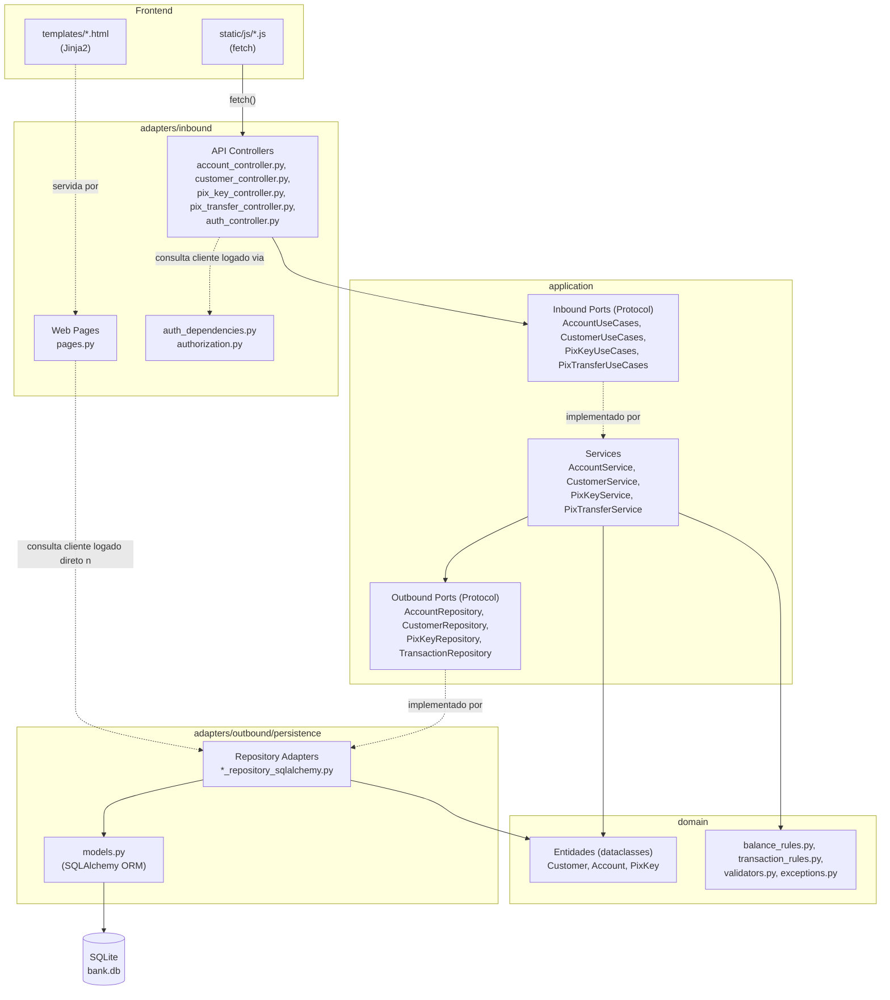
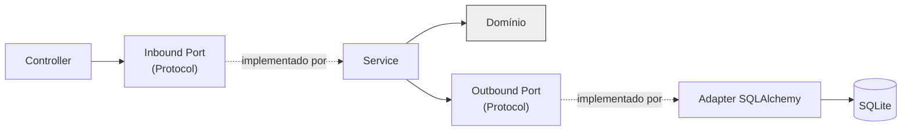
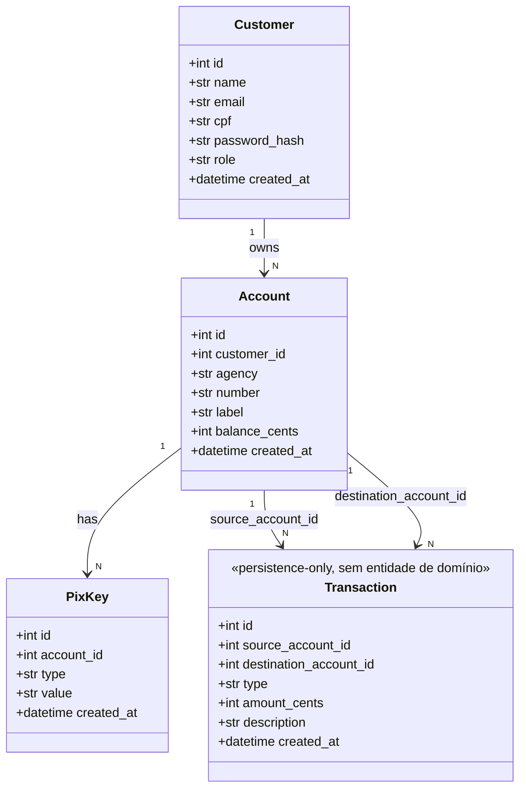
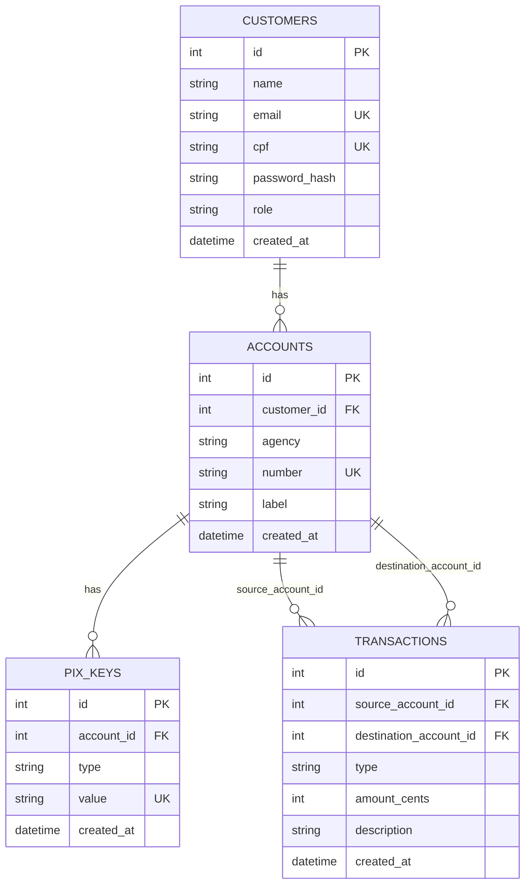
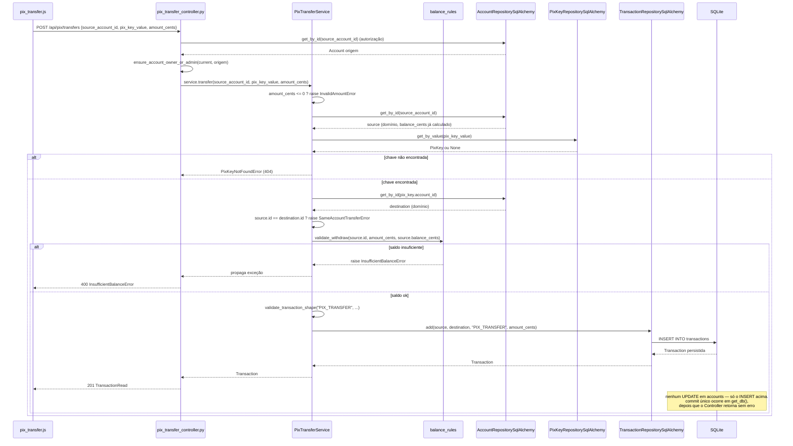

# Banco Digital Acadêmico

Simulação acadêmica de um banco digital (clientes, contas, chaves Pix, depósitos, saques e
transferências Pix internas), construída com FastAPI, SQLAlchemy e SQLite, com frontend em
HTML/CSS/JavaScript consumindo a própria API.

Este README documenta tecnologias, arquitetura, modelo de domínio, banco de dados e as principais
decisões técnicas do projeto. Para o detalhamento completo, veja
[`docs/final/`](docs/final/) — documentação verificada diretamente contra o código-fonte, incluindo
as principais decisões técnicas e de implementação do projeto.

## Sumário

- [Tecnologias](#tecnologias)
- [Arquitetura](#arquitetura)
- [Modelo de domínio](#modelo-de-domínio)
- [Banco de dados](#banco-de-dados)
- [Fluxo em destaque: transferência Pix](#fluxo-em-destaque-transferência-pix)
- [Decisões técnicas](#decisões-técnicas)
- [Estrutura de pastas](#estrutura-de-pastas)
- [Requisitos](#requisitos)
- [Instalação](#instalação)
- [Inicializar o banco de dados](#inicializar-o-banco-de-dados)
- [Login e usuário admin](#login-e-usuário-admin)
- [Executar a aplicação](#executar-a-aplicação)
- [Rodar os testes](#rodar-os-testes)
- [Demonstração ponta a ponta (Playwright)](#demonstração-ponta-a-ponta-playwright)
- [Qualidade de código](#qualidade-de-código)
- [Migrações (Alembic)](#migrações-alembic)

## Tecnologias

| Camada | Tecnologia | Versão | Papel no projeto |
|---|---|---|---|
| API | [FastAPI](https://fastapi.tiangolo.com/) | 0.115 | Framework web — rotas, validação de request/response, OpenAPI/Swagger automático |
| Servidor ASGI | [Uvicorn](https://www.uvicorn.org/) | 0.30 | Serve a aplicação FastAPI, com reload em desenvolvimento |
| ORM | [SQLAlchemy](https://www.sqlalchemy.org/) | 2.0 (estilo `Mapped`/`mapped_column`) | Mapeamento objeto-relacional, `Session` por requisição |
| Banco de dados | [SQLite](https://www.sqlite.org/) | arquivo único `bank.db` | Persistência — sem servidor externo, sem Docker |
| Migrações | [Alembic](https://alembic.sqlalchemy.org/) | 1.13 | Versionamento do schema do banco |
| Validação/DTOs | [Pydantic](https://docs.pydantic.dev/) (via FastAPI) | — | Schemas de entrada/saída da API, `extra="forbid"` nos de entrada |
| Templates | [Jinja2](https://jinja.palletsprojects.com/) | 3.1 | Renderização das páginas HTML servidas pelo backend |
| Sessão/autenticação | `starlette.middleware.sessions` + [itsdangerous](https://itsdangerous.palletsprojects.com/) | 2.2 | Cookie de sessão assinado, sem JWT/OAuth |
| Frontend | HTML/CSS/JavaScript puro | — | Sem framework — todo envio de dado passa por `fetch()` (`static/js/api.js`) |
| Testes | [pytest](https://docs.pytest.org/) + [httpx](https://www.python-httpx.org/) (`TestClient`) | 8.3 / 0.27 | Testes de domínio, serviço e API |
| E2E | [Playwright](https://playwright.dev/python/) | 1.48 | Simulação de uma jornada completa pela interface web |
| Lint/format | [ruff](https://docs.astral.sh/ruff/) + [black](https://black.readthedocs.io/) | 0.7 / 24.10 | Lint e formatação, 100 colunas |

Versões completas em [`requirements.txt`](requirements.txt).

## Arquitetura

O projeto segue uma versão **simplificada** da arquitetura hexagonal (Ports & Adapters): a regra de
negócio (Service + Domínio) não sabe como os dados chegam (HTTP) nem como são salvos (SQL) — ela
depende só de interfaces (`Protocol` do Python), tanto de entrada (*inbound ports*, o que um
Controller pode pedir a um Service) quanto de saída (*outbound ports*, o que um Service precisa de
persistência).



**Direção de dependência:**



A conformidade com um `Protocol` é estrutural (*duck typing*, verificada só por tipagem estática) —
nem o Service importa a implementação concreta do Inbound Port, nem o Adapter importa o Outbound
Port. Quem "aponta" para quem é sempre o consumidor da interface, nunca quem a implementa.

### Camadas

| Camada | Responsabilidade | Exemplos |
|---|---|---|
| **Controller** (`adapters/inbound/api`) | Recebe requisição HTTP, valida forma do corpo (Pydantic), checa autorização, chama o caso de uso, converte o resultado em `*Read` | `account_controller.py`, `pix_transfer_controller.py` |
| **Web Pages** (`adapters/inbound/web`) | Serve HTML (Jinja2); único controle de acesso é "existe sessão válida?" | `pages.py` |
| **Inbound Port** (`application/ports/inbound`) | `Protocol` que descreve os casos de uso disponíveis para o Controller, sem amarrar à classe concreta do Service | `AccountUseCases`, `PixTransferUseCases` |
| **Application Service** (`application/services`) | Orquestra o caso de uso: busca dados via Outbound Port, aplica regras do Domínio, decide o que persistir | `AccountService`, `PixTransferService` |
| **Domínio** (`domain/`) | Entidades (dataclasses, sem comportamento próprio) e regras de negócio como funções puras | `entities/account.py`, `balance_rules.py`, `transaction_rules.py`, `exceptions.py` |
| **Outbound Port** (`application/ports`) | `Protocol` que descreve o que um Service precisa de persistência, sem dizer como | `AccountRepository`, `TransactionRepository` |
| **Repository Adapter** (`adapters/outbound/persistence`) | Implementação concreta da porta com SQLAlchemy — converte entre modelo ORM e entidade de domínio | `account_repository_sqlalchemy.py` |
| **SQLAlchemy models** | Definição das tabelas via `Mapped`/`mapped_column`, `CheckConstraint`, `ForeignKey` | `outbound/persistence/models.py` |
| **SQLite** | Armazenamento físico, arquivo único `bank.db` | `app/infrastructure/config.py` |
| **Frontend (JS)** | Interage com o usuário e fala com a API só via `fetch()` | `static/js/*.js` |

**O que cada camada não faz:** Controller não contém regra de negócio (saldo insuficiente, chave
duplicada etc. vivem no Service/Domínio); Domínio não importa nada de `adapters/`, `fastapi` ou
`sqlalchemy`; não há framework de injeção de dependência — cada controller monta o Service com
`Depends()` nativo do FastAPI, uma função `get_*_service()` por controller. Detalhes completos,
incluindo duas simplificações conscientes documentadas (`Transaction` sem entidade própria; algumas
checagens de autorização lendo o repositório direto, antes do Service) estão em
[`docs/final/03-arquitetura.md`](docs/final/03-arquitetura.md).

## Modelo de domínio

Quatro conceitos: `Customer`, `Account`, `PixKey` e `Transaction`. Todas as entidades são
`dataclass` puras em `app/domain/entities/`, sem dependência de SQLAlchemy ou FastAPI, e **sem
comportamento próprio** — validações e regras de negócio vivem em módulos de função pura ao lado
delas (`balance_rules.py`, `transaction_rules.py`, `validators.py`), não em métodos das entidades.



`Account.balance_cents` é o único campo do diagrama que não é um valor persistido diretamente: ele é
sempre calculado a partir da soma das `Transaction` da conta (ver "Banco de dados" abaixo). As
regras de negócio — CPF/email únicos, saldo insuficiente, chave Pix duplicada, transferência para a
própria conta — geram um conjunto de exceções próprias (`app/domain/exceptions.py`, todas herdando
de `DomainError`), mapeadas para status HTTP na borda da API. Detalhamento completo em
[`docs/final/04-modelo-de-dominio.md`](docs/final/04-modelo-de-dominio.md).

## Banco de dados

SQLite, arquivo único `bank.db`, schema definido via SQLAlchemy em
`app/adapters/outbound/persistence/models.py` e versionado com Alembic (`alembic/versions/`).



Dinheiro é sempre `INTEGER` em centavos (`amount_cents`), nunca `float` — evita erro de
arredondamento binário. `ACCOUNTS` **não tem coluna de saldo**: desde a migration
`0f4be3daa031_remove_balance_cents_from_accounts`, `TRANSACTIONS` é a única fonte de verdade sobre
movimentações financeiras (*event sourcing*, escopado ao saldo de conta). Depositar, sacar e
transferir são sempre um único `INSERT` em `transactions`; o saldo de uma conta é recalculado a cada
leitura, somando créditos (`destination_account_id`) e subtraindo débitos (`source_account_id`) em
`AccountRepositorySqlAlchemy._compute_balance()`. `ON DELETE RESTRICT` em todas as FKs é uma rede de
segurança no banco — a validação de fato acontece nos Services (`AccountService.delete()`,
`CustomerService.delete()`). Detalhamento completo, incluindo os índices e o motivo de duas FKs
opcionais em `transactions`, em [`docs/final/05-banco-de-dados.md`](docs/final/05-banco-de-dados.md).

## Fluxo em destaque: transferência Pix

O fluxo mais elaborado do sistema — combina domínio, validação de saldo via event sourcing e
atomicidade de sessão:



Nenhuma conta é mutada em nenhum ponto do fluxo — o único efeito colateral no banco é o `INSERT` em
`transactions`. Se qualquer validação falhar antes dele (saldo insuficiente, chave inexistente),
nada foi escrito ainda; se o próprio `INSERT` falhar, o commit único de `get_db()` nunca é alcançado.
Diagramas equivalentes para depósito e saque, e o passo a passo completo, estão em
[`docs/final/07-fluxos-principais.md`](docs/final/07-fluxos-principais.md).

## Decisões técnicas

Registro completo no estilo *Architecture Decision Record* em
[`docs/final/10-decisoes-tecnicas.md`](docs/final/10-decisoes-tecnicas.md) (alternativas
consideradas, motivo e trade-off de cada uma). Resumo:

| # | Decisão | Escolha | Por quê |
|---|---|---|---|
| D1 | Framework de API | FastAPI | Exigência do enunciado; OpenAPI automático, `Depends()` nativo, validação via Pydantic |
| D2 | Banco de dados | SQLite, arquivo único | Exigência do enunciado — roda sem infraestrutura externa |
| D3 | ORM | SQLAlchemy 2.x (`Mapped`/`mapped_column`) | Tipagem estática nas colunas, migrações via Alembic sobre `Base.metadata` |
| D4 | Concorrência | `Session` síncrona, sem `asyncio` | SQLite tem um único *writer* de qualquer forma; código mais simples de ler |
| D5 | Dinheiro | `int` em centavos, nunca `float`/`Decimal` | Evita erro de arredondamento binário sem exigir `TypeDecorator` customizado |
| D6 | Arquitetura | Hexagonal simplificada (sem Unit of Work genérico) | Separa Controller/Service (exigência central) sem abstrações sem público real |
| D7 | Ports | `typing.Protocol` (não `abc.ABC`) | Tipagem estrutural — repositório de teste satisfaz a interface sem herdar de nada |
| D8 | `Transaction` | Só modelo SQLAlchemy, sem entidade de domínio própria | É um registro *create-only*; entidade separada seria puro boilerplate |
| D9 | Autenticação | Sessão via cookie assinado, sem JWT/OAuth | Suficiente pra distinguir "minha conta" de "conta de outro cliente" |
| D11 | Injeção de dependência | Só `Depends()` do FastAPI, sem framework de DI | O problema real (montar Service com os Adapters certos) não justifica um container |
| D12 | CQRS / microserviços | Nenhum dos dois | Sem modelo de leitura divergente do de escrita nem necessidade de escala/deploy independente |
| D13 | Saldo de conta | *Event sourcing* — `transactions` como única fonte de verdade, saldo derivado | Elimina redundância entre estado (`balance_cents`) e histórico; ver "Banco de dados" acima |

## Estrutura de pastas

```
app/
  domain/
    entities/            # Customer, Account, PixKey, Transaction — dataclasses puras, sem comportamento
    balance_rules.py      # validate_deposit(), validate_withdraw() — saldo via event sourcing
    transaction_rules.py   # validate_transaction_shape()
    validators.py            # CPF, email, telefone, formato de chave Pix por tipo
    password_hashing.py       # hash_password() / verify_password() (PBKDF2-HMAC)
    exceptions.py               # exceções de domínio, sem SQLAlchemy/FastAPI

  application/
    services/              # AccountService, CustomerService, PixKeyService, PixTransferService
    ports/
      inbound/              # Protocols de caso de uso (o que o Controller pode pedir)
      *.py                    # Protocols de repositório (o que um Service precisa persistir)

  adapters/
    inbound/
      api/                  # Controllers REST, schemas Pydantic, autenticação/autorização
      web/                   # rotas que servem as páginas HTML (pages.py)
    outbound/
      persistence/            # models.py (SQLAlchemy ORM) + *_repository_sqlalchemy.py

  infrastructure/            # engine, sessionmaker, Base, get_db(), config (DATABASE_URL, SECRET_KEY)
  templates/                  # páginas Jinja2 (login, dashboard, contas, extrato, transferência Pix)
  static/
    css/style.css
    js/                        # api.js (fetch + formatCents), auth.js, e um módulo por página

  main.py                      # cria a app FastAPI, registra routers, roda migração + admin no boot

scripts/
  init_db.py                   # Base.metadata.create_all() — atalho, usado pelos testes
  create_admin.py                # bootstrap do primeiro usuário admin (fora da API)
  e2e_demo.py                     # demonstração Playwright ponta a ponta, banco isolado

alembic/
  versions/                     # migrações versionadas
  env.py                          # aponta para Base.metadata e DATABASE_URL da aplicação

tests/
  unit/                         # domínio puro (validators, transaction_rules, password_hashing)
  service/                       # services contra SQLite temporário
  api/                            # endpoints via TestClient

docs/
  final/                          # documentação "como foi implementado", verificada contra o código

pyproject.toml                     # configuração do black e do ruff
```

## Requisitos

- Python 3.12+

## Instalação

```bash
python3 -m venv .venv
source .venv/bin/activate
pip install -r requirements.txt
```

## Inicializar o banco de dados

Duas formas equivalentes de criar o schema num banco novo:

```bash
python -m scripts.init_db        # cria as tabelas direto do metadata do SQLAlchemy
# ou, recomendado a partir de agora (fica com histórico de versão):
alembic upgrade head
```

`scripts.init_db` roda `Base.metadata.create_all()` — rápido, sem histórico, e é o que a própria
aplicação usa automaticamente ao subir se o banco ainda não existir. `alembic upgrade head` aplica
as migrações versionadas em `alembic/versions/` e é o caminho recomendado quando o schema precisar
evoluir depois (nova coluna, novo índice etc.): gere a alteração no `app/adapters/outbound/persistence/models.py`,
depois `alembic revision --autogenerate -m "descrição"` e revise o arquivo gerado antes de aplicar.

Se você já tem um `bank.db` criado antes do Alembic existir (via `create_all`, sem a tabela
`alembic_version`), marque-o como já estando na revisão atual em vez de recriar as tabelas:

```bash
alembic stamp head
```

## Login e usuário admin

A aplicação exige login (sessão via cookie). Como criar clientes é uma operação restrita a admin,
é preciso criar o primeiro admin diretamente (sem passar pela API):

```bash
python -m scripts.create_admin
```

Cria o admin `admin@example.com` / senha `admin123` (personalizável com `--name`, `--email`, `--cpf`
e `--password`). Faça login em `/login` com essas credenciais para cadastrar clientes (com senha) e
abrir contas para eles. Um cliente logado só vê e opera as próprias contas; o admin vê e opera
tudo, incluindo depósito em conta de qualquer cliente.

> Se você já tinha um `bank.db` de antes da autenticação existir, apague-o e recrie
> (`rm bank.db && python -m scripts.init_db`) — as novas colunas de login em `customers` são
> `NOT NULL`. **Cuidado:** nunca apague/recrie o `bank.db` enquanto um `uvicorn` estiver rodando
> contra ele — o processo fica com um handle para o arquivo antigo e passa a falhar com
> "readonly database"; reinicie o servidor depois de trocar o arquivo.

## Executar a aplicação

```bash
python -m app.main
```

Roda a migração do Alembic até a mais recente, garante que o admin inicial existe
(`scripts.create_admin`, com os mesmos defaults) e só então sobe o servidor com reload — tudo em um
único comando. Equivalente a rodar manualmente:

```bash
alembic upgrade head
python -m scripts.create_admin
uvicorn app.main:app --reload
```

(a segunda forma é útil se você quiser controlar cada passo separadamente, ou já tem os dois feitos).

- Interface web: http://127.0.0.1:8000/
- Documentação interativa da API (Swagger): http://127.0.0.1:8000/docs

## Rodar os testes

```bash
pytest
```

Os testes usam um banco SQLite temporário por teste — não afetam o `bank.db` usado pela aplicação
em execução normal.

## Demonstração ponta a ponta (Playwright)

```bash
playwright install chromium   # só na primeira vez
python -m scripts.e2e_demo             # headless
python -m scripts.e2e_demo --headed    # abre o navegador visível
```

Sobe uma instância isolada da aplicação (porta e banco SQLite temporários — não toca no `bank.db`
real) e simula pela interface web uma jornada completa: admin cadastra dois clientes e abre uma
conta para cada um, deposita numa delas, cadastra para a outra uma chave Pix `RANDOM` (valor gerado
automaticamente), o primeiro cliente loga e deposita/saca/transfere na própria conta, confirma que
não vê o link "Clientes" nem contas de terceiros, e o extrato reflete tudo. Screenshots de cada
etapa ficam em `playwright-artifacts/`.

## Qualidade de código

```bash
black app scripts tests          # formata
ruff check app scripts tests     # lint (use --fix para autocorrigir o que for possível)
```

Configuração em [`pyproject.toml`](pyproject.toml) (linha de 100 colunas para os dois). O hook de
geração de migração do Alembic já roda `black`/`ruff` automaticamente no arquivo gerado.

## Migrações (Alembic)

```bash
alembic revision --autogenerate -m "descrição da alteração"   # gera uma migração a partir do diff
alembic upgrade head                                            # aplica até a mais recente
alembic downgrade -1                                             # desfaz a última
```

`alembic/env.py` usa a mesma `DATABASE_URL` da aplicação (`app/infrastructure/config.py`) e conhece
todas as entidades via `app.adapters.outbound.persistence.models`. Para gerar/testar uma migração
sem tocar no `bank.db` real, aponte para outro arquivo temporariamente:
`ALEMBIC_DATABASE_URL="sqlite:///teste.db" alembic upgrade head`.
