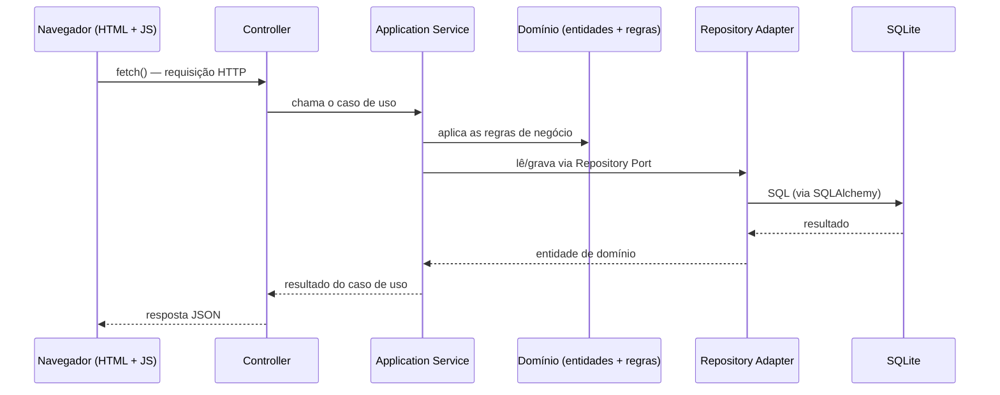

# 01 — Visão Geral

## Contexto

Este projeto é um trabalho acadêmico da disciplina de desenvolvimento de sistemas com Python, que
simula, de forma simplificada, um **banco digital**. A aplicação permite cadastrar clientes, abrir
contas, registrar chaves Pix simuladas, realizar depósitos, saques e transferências Pix internas, e
consultar o saldo e o extrato de uma conta.

**Não é um banco real.** Não há integração com o Banco Central, com o sistema Pix verdadeiro, com
nenhum gateway de pagamento, nem qualquer processamento financeiro real. Toda a "transferência Pix"
é uma simulação interna: debita uma conta e credita outra dentro do próprio banco de dados do
projeto.

## Objetivo acadêmico

O objetivo pedagógico central não é reproduzir um sistema bancário completo, mas demonstrar, de
forma simples e tecnicamente correta, a integração entre as camadas que compõem um sistema web
real:

- **frontend** (HTML + CSS + JavaScript puro, sem framework);
- **API** (FastAPI, camada de Controller/rotas);
- **regras de negócio** (camada de Application Service e de Domínio);
- **persistência** (SQLite, acessado via SQLAlchemy);
- **organização de código em camadas**, com Controller e Service claramente separados — o requisito
  central do enunciado — sobre uma arquitetura hexagonal simplificada (ver `03-arquitetura.md`).

## Problema sendo resolvido

O enunciado do trabalho exige um sistema com FastAPI, banco SQLite, separação entre Controller e
Service, pelo menos dois modelos relacionados, CRUD completo, e uma interface web em HTML/CSS que
consome a API via `fetch()`. Um banco digital simplificado é um domínio que se presta bem a esse
exercício: tem entidades naturalmente relacionadas (cliente → conta → chave Pix → transação), tem
regras de negócio reais e não triviais (saldo não pode ficar negativo, valores devem ser positivos,
uma transferência não pode deixar o sistema em estado inconsistente), e tem operações que mapeiam
claramente para CRUD e para casos de uso específicos (depósito, saque, transferência, extrato).

## Escopo

Está dentro do escopo implementado:

- Cadastro, consulta, atualização e remoção (CRUD) de clientes, contas e chaves Pix.
- Depósito, saque e transferência Pix entre contas do próprio banco simulado.
- Consulta de saldo e extrato de uma conta.
- Autenticação por sessão (login/logout) com dois papéis: `ADMIN` e `CUSTOMER`.
- Interface web com 6 páginas (`/login`, `/`, `/customers`, `/accounts`, `/accounts/{id}`,
  `/pix/transfer`) consumindo a API exclusivamente via `fetch()`.
- Suíte de testes automatizados (`pytest`) cobrindo domínio, serviços e API.

Está fora do escopo, deliberadamente (ver `10-decisoes-tecnicas.md` para a justificativa de cada
item):

- Integração real com o Banco Central, com o sistema Pix ou com qualquer gateway de pagamento.
- OAuth/JWT, verificação de e-mail, recuperação de senha.
- CQRS, event sourcing, filas de mensageria, microserviços, containers obrigatórios.
- Frameworks de injeção de dependência (usa-se apenas `Depends()` do próprio FastAPI).

## Principais funcionalidades

| Funcionalidade | Onde vive no código |
|---|---|
| Login/logout por sessão | `app/adapters/inbound/api/auth_controller.py`, `auth_dependencies.py` |
| CRUD de clientes | `app/adapters/inbound/api/customer_controller.py` + `CustomerService` |
| CRUD de contas | `app/adapters/inbound/api/account_controller.py` + `AccountService` |
| CRUD de chaves Pix | `app/adapters/inbound/api/pix_key_controller.py` + `PixKeyService` |
| Depósito e saque | `AccountService.deposit()` / `AccountService.withdraw()` |
| Transferência Pix | `app/adapters/inbound/api/pix_transfer_controller.py` + `PixTransferService` |
| Extrato de conta | `AccountService.get_statement()` |
| Interface web | `app/templates/*.html` (Jinja2) + `app/static/js/*.js` (fetch) |

## Tecnologias utilizadas

| Categoria | Tecnologia | Uso no projeto |
|---|---|---|
| Backend / API | **FastAPI** 0.115 | roteamento, validação de request/response via Pydantic, OpenAPI automático |
| Banco de dados | **SQLite** | arquivo único `bank.db`, sem infraestrutura externa |
| ORM | **SQLAlchemy** 2.0 (estilo `Mapped`/`mapped_column`) | mapeamento objeto-relacional, `Session` por requisição |
| Migrações | **Alembic** | histórico versionado de alterações de schema |
| Servidor | **uvicorn** | servidor ASGI usado em desenvolvimento |
| Sessão | `SessionMiddleware` (Starlette) + `itsdangerous` | cookie de sessão assinado, sem JWT |
| Frontend | HTML + CSS puro + **JavaScript vanilla** | 6 páginas Jinja2, sem framework SPA |
| Testes | **pytest** + `fastapi.testclient.TestClient` | testes de domínio, de serviço e de API |
| Qualidade | `black` + `ruff` | formatação e lint, 100 colunas |
| Demonstração | **Playwright** (`scripts/e2e_demo.py`) | simulação ponta a ponta pela interface web (extra, não faz parte da suíte `pytest`) |

## Fluxo geral do sistema

Toda operação de negócio (criar, consultar, depositar, transferir...) segue o mesmo caminho de ida e
volta, do navegador até o banco de dados:

As páginas HTML em si (`/login`, `/`, `/customers` etc.) são servidas separadamente pelo Jinja2 —
o navegador as carrega por navegação normal, não por `fetch()` — mas todo o **dado** que aparece
dentro delas (listas, saldos, extratos) chega depois, pelo mesmo caminho acima, disparado pelo
JavaScript da página (ver `08-frontend.md`).

Este fluxo — Controller → Service → Domínio/Port → Adapter → SQLite — é detalhado camada por camada,
com a direção de dependência estática entre os módulos, em `03-arquitetura.md`, e rastreado com
exemplos concretos de código (classes, métodos e arquivos reais) em `07-fluxos-principais.md`.

## Como este documento se relaciona com os demais

Este conjunto de documentos (`docs/final/`) descreve o sistema **como ele foi efetivamente
implementado**, verificado contra o código-fonte e contra o grafo de conhecimento gerado pelo
Graphify sobre este repositório. Onde a implementação diverge do design original em
`docs/specs/`, a diferença é apontada explicitamente — nunca omitida. Veja o índice completo em
[`README.md`](README.md).
