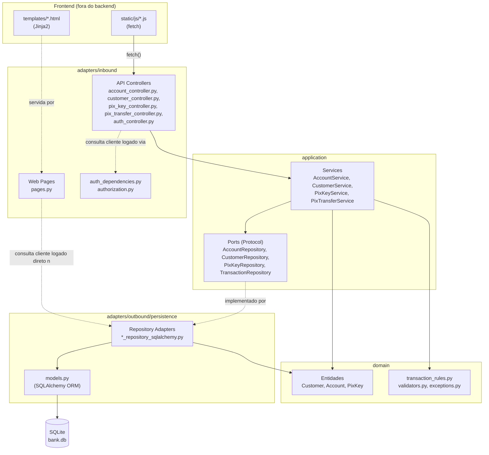
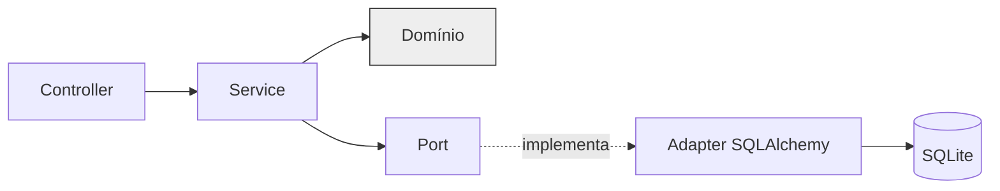

# 03 — Arquitetura

## Por que arquitetura hexagonal simplificada

O projeto segue uma versão **simplificada** da arquitetura hexagonal (Ports & Adapters) — o
suficiente para satisfazer o requisito central do enunciado (separação explícita entre Controller e
Service) e para ser explicável em poucos minutos numa apresentação oral, sem introduzir
infraestrutura que um projeto acadêmico deste porte não justifica: sem microserviços, sem CQRS, sem
event sourcing, sem framework de injeção de dependência.

A ideia central que se mantém, mesmo simplificada, é: **a regra de negócio (Service + Domínio) não
sabe como os dados chegam (HTTP) nem como são salvos (SQL)**. Ela depende apenas de interfaces
(`Protocol` do Python) — os *Repository Ports*. Quem implementa essas interfaces com SQLAlchemy é
uma classe concreta separada, substituível em teoria sem tocar no Service.

Direção de dependência pretendida e majoritariamente seguida no código real:

```
Controller (adapter de entrada)
    ↓
Application Service / caso de uso
    ↓
Domínio (entidades + regras de negócio)
    ↓
Repository Port (interface)
    ↓
Repository Adapter SQLAlchemy (adapter de saída)
    ↓
SQLite
```

## Diagrama de componentes



## Diagrama de direção de dependências



A seta pontilhada de `Port` para `Adapter` indica **implementação**, não importação de código: o
`Adapter` importa o `Port`? Na verdade, nem isso — os adapters concretos (`AccountRepositorySqlAlchemy`
etc.) **não importam** o módulo do `Port`. A conformidade com o `Protocol` é estrutural (*duck
typing* verificado apenas por tipagem estática, não em runtime): qualquer classe que tenha os
métodos certos satisfaz o `Protocol`, sem herança explícita. Isso é uma simplificação deliberada —
sem isso, a "implementação" da porta seria apenas nominal.

## Estrutura de diretórios (real, verificada no código)

```
app/
  domain/
    entities/
      customer.py            # dataclass pura
      account.py               # dataclass pura + deposit()/withdraw()
      pix_key.py                # dataclass pura
    exceptions.py                # 18 exceções de domínio, sem SQLAlchemy/FastAPI
    validators.py                 # CPF, email, telefone, formato de chave Pix por tipo
    transaction_rules.py           # validate_transaction_shape()
    password_hashing.py             # hash_password() / verify_password() (PBKDF2-HMAC)

  application/
    services/
      customer_service.py
      account_service.py
      pix_key_service.py
      pix_transfer_service.py
    ports/
      customer_repository.py     # Protocol
      account_repository.py
      pix_key_repository.py
      transaction_repository.py

  adapters/
    inbound/
      api/
        auth_controller.py        # POST /api/auth/login, /logout, GET /api/auth/me
        auth_dependencies.py        # get_current_customer() — resolve sessão
        authorization.py             # ensure_admin, ensure_self_or_admin, ensure_account_owner_or_admin
        customer_controller.py
        account_controller.py
        pix_key_controller.py
        pix_transfer_controller.py
        exception_handlers.py         # mapeia exceção de domínio → status HTTP
        schemas.py                     # DTOs Pydantic, extra="forbid" nos de entrada
      web/
        pages.py                        # rotas que servem os templates HTML
    outbound/
      persistence/
        models.py                        # SQLAlchemy 2.x ORM: Customer, Account, PixKey, Transaction
        customer_repository_sqlalchemy.py
        account_repository_sqlalchemy.py
        pix_key_repository_sqlalchemy.py
        transaction_repository_sqlalchemy.py

  infrastructure/
    db.py                        # engine, sessionmaker, Base, get_db()
    config.py                     # DATABASE_URL, SECRET_KEY

  templates/                     # Jinja2: login, dashboard, customers, accounts, account_detail, pix_transfer
  static/
    css/style.css
    js/
      api.js                     # apiGet/apiPost/apiPut/apiDelete + formatCents()
      auth.js                     # barra de usuário logado, gate de admin, logout
      login.js, dashboard.js, customers.js, accounts.js, account_detail.js, pix_transfer.js

  main.py                        # cria a app FastAPI, registra routers e handlers

scripts/
  init_db.py                     # Base.metadata.create_all(engine) — atalho, usado pelos testes
  create_admin.py                 # bootstrap do primeiro usuário admin (fora da API)
  e2e_demo.py                      # demonstração Playwright ponta a ponta

alembic/
  env.py, versions/                # migrações versionadas do schema

tests/
  unit/, service/, api/            # ver 09-testes.md
```

## Tabela de camadas

| Camada | Responsabilidade | Arquivos de exemplo |
|---|---|---|
| **Controller** (inbound/api) | Recebe requisição HTTP, valida forma do corpo (Pydantic), checa autorização, chama o Service, converte o resultado em `*Read` | `account_controller.py`, `pix_transfer_controller.py` |
| **Web Pages** (inbound/web) | Serve HTML (Jinja2); único controle de acesso é "existe sessão válida?" | `pages.py` |
| **Application Service** | Orquestra o caso de uso: busca dados via Port, aplica regras do Domínio, decide o que persistir | `AccountService`, `PixTransferService` |
| **Domínio** | Entidades com estado e comportamento (`Account.deposit()`), validações e exceções puras | `entities/account.py`, `transaction_rules.py`, `exceptions.py` |
| **Repository Port** | Interface (`Protocol`) que descreve o que um Service precisa de persistência, sem dizer como | `application/ports/account_repository.py` |
| **Repository Adapter** | Implementação concreta da porta com SQLAlchemy — converte entre modelo ORM e entidade de domínio | `account_repository_sqlalchemy.py` |
| **SQLAlchemy models** | Definição das tabelas via `Mapped`/`mapped_column`, `CheckConstraint`, `ForeignKey` | `outbound/persistence/models.py` |
| **SQLite** | Armazenamento físico, arquivo único `bank.db` | `app/infrastructure/config.py::DATABASE_PATH` |
| **Frontend (JS)** | Interage com o usuário e fala com a API só via `fetch()` | `static/js/*.js` |

## O que cada camada NÃO faz (limites explícitos)

- **Controller não contém regra de negócio.** Toda decisão de "isso pode ou não pode acontecer" —
  saldo insuficiente, chave duplicada, cliente com contas — vive no Service ou no Domínio, nunca no
  corpo de uma função de rota.
- **Domínio não importa nada de `adapters/` nem de `fastapi`/`sqlalchemy`.** Verificado
  diretamente no código: nenhum arquivo em `app/domain/` importa esses módulos.
- **Repository Adapter não importa `application/ports`.** A conformidade com o `Protocol` é
  estrutural, não por herança — reforça que quem depende da porta é o Service, nunca o contrário.
- **Nenhuma dependência circular** entre módulos do backend — verificado com o Graphify: a seção
  "Import Cycles" do relatório gerado sobre este repositório (`graphify-out/GRAPH_REPORT.md`) reporta
  zero ciclos.

## Simplificações conscientes desta arquitetura

Um projeto acadêmico deste porte ganha mais em clareza do que em pureza arquitetural. Duas
simplificações são documentadas deliberadamente e se confirmam no código:

### 1. `Transaction` é entidade de domínio

`Customer`, `Account`, `PixKey` e `Transaction` são `dataclass` puras em
`app/domain/entities/`. A porta `TransactionRepository` e os services dependem de
`app.domain.entities.transaction.Transaction`; o adapter SQLAlchemy converte entre a entidade e o
modelo ORM. Assim, a camada de aplicação não depende de `adapters/outbound`.

### 2. Checagens de autorização leem o repositório diretamente, antes do Service

Este é um ponto que o design original não detalha explicitamente, mas que existe de forma
consistente no código: para decidir **se** um cliente pode chamar um Service (é dono da conta? é
admin?), o Controller precisa primeiro **ler** a conta — e essa leitura, em alguns pontos, acontece
direto no Repository Adapter, antes (ou em paralelo) da chamada ao Service:

- `auth_dependencies.py::get_current_customer()` resolve o cliente da sessão chamando
  `CustomerRepositorySqlAlchemy(db).get_by_id(customer_id)` diretamente — não passa por
  `CustomerService`.
- `adapters/inbound/web/pages.py::_current_customer()` faz exatamente a mesma leitura, duplicada,
  para o *gate* de acesso às páginas HTML.
- `pix_key_controller.py::_ensure_owns_account()` e `pix_transfer_controller.py::transfer()`
  instanciam `AccountRepositorySqlAlchemy(db)` diretamente para buscar a conta e verificar posse,
  antes de delegar a operação em si ao Service correspondente.

Na prática, isso significa que a leitura usada **apenas para controle de acesso** (não a operação de
negócio propriamente dita) pula a camada de Service e vai direto ao Adapter de persistência. A
operação de negócio em si — criar, depositar, transferir — sempre passa pelo Service correto. É uma
simplificação pragmática, coerente com o restante do projeto (autorização vive nos Controllers, não
nos Services, conforme `06-api.md`), mas vale deixar registrado com honestidade: é uma pequena
inversão do fluxo `Controller → Service → Port → Adapter` puro, não uma falha silenciosa — a lógica
de negócio nunca é duplicada nesses pontos, só a leitura de apoio à autorização.

### Por que essas concessões são aceitáveis aqui

Nenhuma das duas quebra as garantias que o projeto realmente precisa (atomicidade das operações
financeiras, saldo nunca negativo, dados sempre no formato esperado). Ambas são **localizadas,
consistentes e fáceis de apontar** — o que é exatamente a régua correta para um trabalho acadêmico
avaliado por clareza de raciocínio arquitetural, não por conformidade certificada a um padrão.
`10-decisoes-tecnicas.md` retoma esse ponto com a comparação de alternativas.

## Wiring de dependências (sem framework de DI)

Sem container de injeção de dependência — apenas `Depends()` do próprio FastAPI. Cada controller
define uma função `get_*_service()` que constrói o Service com os Repository Adapters concretos,
usando a `Session` da requisição:

```python
# app/adapters/inbound/api/account_controller.py
def get_account_service(db: Session = Depends(get_db)) -> AccountService:
    return AccountService(
        account_repo=AccountRepositorySqlAlchemy(db),
        customer_repo=CustomerRepositorySqlAlchemy(db),
        transaction_repo=TransactionRepositorySqlAlchemy(db),
    )
```

Cada requisição recebe sua própria `Session` (via `get_db()`), reaproveitada para instanciar todos
os repositórios daquela requisição — inclusive entre controllers: `customer_controller.py` importa
`get_account_service` de `account_controller.py` para listar as contas de um cliente sem duplicar a
função de wiring.

## Atomicidade: como funciona de fato

O código implementado usa um mecanismo simples para preservar a atomicidade:

1. `get_db()` (`app/infrastructure/db.py`) abre uma única `Session` por requisição
   (`with SessionLocal() as session: yield session; session.commit()`).
2. Cada método de Repository Adapter (`add`, `update`, `delete`) chama `session.flush()`, nunca
   `session.commit()` — os dados ficam visíveis dentro da mesma transação, mas não confirmados no
   arquivo do banco.
3. Se o Service (ex.: `PixTransferService.transfer()`) completa sem lançar exceção, a execução volta
   para `get_db()`, que roda `session.commit()` **uma única vez**, confirmando todas as alterações
   feitas durante a requisição.
4. Se qualquer exceção for levantada no meio do caminho (ex.: `InsufficientBalanceError`), a linha
   `session.commit()` nunca é alcançada — o gerenciador de contexto `with SessionLocal() as
   session:` fecha a sessão sem commit, o que descarta a transação aberta (equivalente a um
   rollback).

Ou seja: a atomicidade não vem de um bloco `with session.begin(): ...` explícito no Service, e sim
do fato de que **toda a requisição usa uma única `Session`, com um único ponto de commit no fim**.
O teste `tests/service/test_pix_transfer_service.py::test_transfer_atomicity_on_failure` reproduz
esse mecanismo manualmente (`db_session.rollback()`) e comprova, consultando o banco depois, que
nenhuma conta foi alterada quando a criação da `Transaction` falha no meio da transferência. Ver
`07-fluxos-principais.md` para o passo a passo completo.

## Resumo

A arquitetura entrega o que o enunciado pede — Controller e Service claramente separados, domínio
com regras reais, persistência isolada atrás de interfaces — sem fingir ser um sistema de produção.
As duas concessões documentadas acima (Transaction sem entidade própria; leitura de autorização
direta no repositório) são exatamente o tipo de decisão que vale a pena explicar em uma apresentação
oral: mostram que a simplificação foi escolhida conscientemente, não que a arquitetura em camadas
não foi compreendida.
