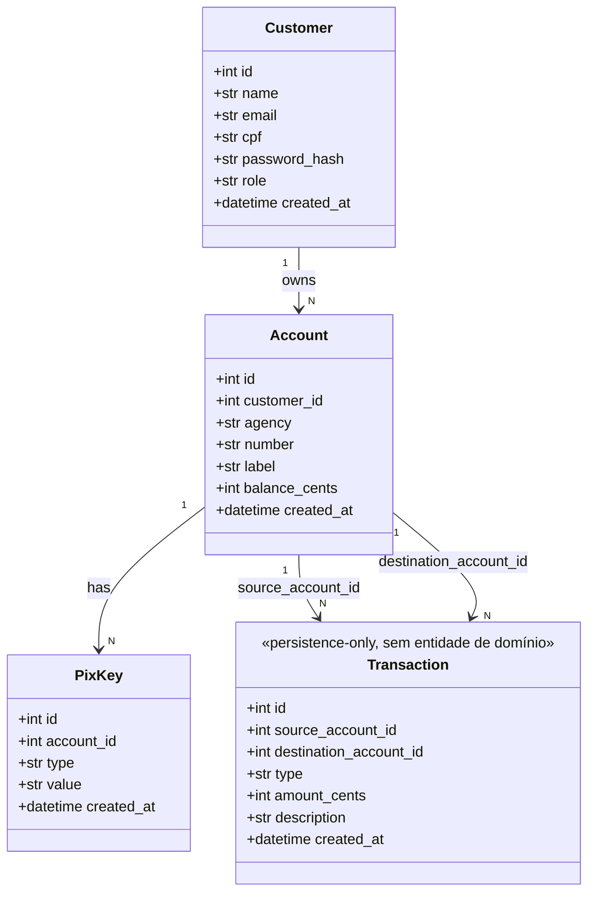

# 04 — Modelo de Domínio

## Visão geral

O domínio tem 4 conceitos: `Customer`, `Account`, `PixKey` e `Transaction`. Todos são **entidades
de domínio puras** — `dataclass` do Python, em `app/domain/entities/`, sem nenhuma dependência de
SQLAlchemy ou de qualquer outra camada.

| Conceito | É entidade de domínio pura? | Onde vive |
|---|---|---|
| `Customer` | Sim | `app/domain/entities/customer.py` |
| `Account` | Sim (dataclass sem comportamento — saldo é derivado, não estado) | `app/domain/entities/account.py` |
| `PixKey` | Sim | `app/domain/entities/pix_key.py` |
| `Transaction` | Sim | `app/domain/entities/transaction.py` |

## `Customer`

**Responsabilidade:** representar uma pessoa cadastrada no banco simulado — cliente comum ou
administrador. É o único conceito de domínio que também carrega autenticação (hash de senha, papel).

```python
@dataclass
class Customer:
    id: int | None
    name: str
    email: str
    cpf: str
    password_hash: str
    role: str = "CUSTOMER"
    created_at: datetime | None = None
```

| Campo | Regra |
|---|---|
| `email` | formato válido (`domain/validators.py::is_valid_email`); único no sistema |
| `cpf` | 11 dígitos com dígito verificador válido (`is_valid_cpf`); único no sistema; **imutável** após criação |
| `password_hash` | nunca é a senha em texto puro — gerado por `password_hashing.hash_password()` |
| `role` | `"ADMIN"` ou `"CUSTOMER"` |

**Relacionamentos:** um `Customer` possui zero ou mais `Account` (`Customer 1 — N Account`).

**Regras de negócio:** `Customer` em si é uma entidade sem métodos de comportamento (dataclass sem
lógica) — as regras que o envolvem (unicidade de email/CPF, bloqueio de exclusão com contas
associadas, autenticação) vivem em `CustomerService`, não na entidade. `Account` segue o mesmo
padrão (ver seção `Account` abaixo): as regras de depósito/saque vivem em
`app/domain/balance_rules.py`, não em métodos da entidade.

**Exceções relacionadas:** `CustomerNotFoundError`, `DuplicateEmailError`, `DuplicateCpfError`,
`InvalidCpfError`, `CustomerHasAccountsError`, `InvalidCredentialsError`, `NotAuthenticatedError`.

## `Account`

**Responsabilidade:** representar uma conta bancária vinculada a um cliente. Não guarda saldo como
estado próprio — o saldo é sempre derivado da soma das `Transaction` da conta (event sourcing).

```python
@dataclass
class Account:
    id: int | None
    customer_id: int
    agency: str
    number: str
    label: str | None = None
    balance_cents: int = 0
    created_at: datetime | None = None
```

`balance_cents` continua existindo como campo da entidade, mas deixou de ser estado gravado: é
preenchido em tempo de leitura por `AccountRepositorySqlAlchemy._to_domain()`, que soma os créditos
(`destination_account_id == account.id`) e subtrai os débitos (`source_account_id == account.id`)
de `transactions`. A tabela `accounts` não tem mais coluna de saldo (ver `05-banco-de-dados.md`).

| Campo | Regra |
|---|---|
| `customer_id` | referencia um `Customer` existente |
| `number` | único globalmente no sistema |
| `agency` | informativo, não entra em regra de unicidade |
| `label` | apelido opcional |
| `balance_cents` | derivado de `transactions`; nunca persistido diretamente |

**Relacionamentos:** pertence a um `Customer`; possui zero ou mais `PixKey`; participa de zero ou
mais `Transaction`, tanto como origem quanto como destino.

**Business rules e invariantes (verificáveis diretamente no código):**

- **Valor inválido:** `balance_rules.validate_deposit()` e `balance_rules.validate_withdraw()`
  (`app/domain/balance_rules.py`) rejeitam `amount_cents <= 0` com `InvalidAmountError` — chamadas
  por `AccountService.deposit()`/`withdraw()` e por `PixTransferService.transfer()`.
- **Saldo insuficiente:** `balance_rules.validate_withdraw()` rejeita `amount_cents >
  current_balance_cents` com `InsufficientBalanceError`, antes de gravar a transação — nenhum
  evento de saque/transferência é persistido se a validação falhar.
- **Saldo nunca negativo:** como só existe crédito (soma) ou débito validado contra o saldo atual,
  não há caminho de código que produza um saldo somado negativo — não depende mais de uma
  `CheckConstraint` no banco (removida junto com a coluna), só da soma dos eventos.
- **Exclusão bloqueada:** uma `Account` só pode ser removida se não tiver `PixKey` nem `Transaction`
  associada — regra aplicada em `AccountService.delete()`. Não existe mais checagem explícita de
  saldo: saldo não-zero sempre implica pelo menos uma `Transaction`, então `has_transactions()`
  já cobre esse caso.

**Exceções relacionadas:** `AccountNotFoundError`, `DuplicateAccountNumberError`,
`InvalidAmountError`, `InsufficientBalanceError`, `AccountHasDependenciesError`.

## `PixKey`

**Responsabilidade:** representar uma chave Pix simulada, vinculada a uma conta, usada para resolver
a conta de destino em uma transferência.

```python
@dataclass
class PixKey:
    id: int | None
    account_id: int
    type: str
    value: str
    created_at: datetime | None = None
```

| Campo | Regra |
|---|---|
| `account_id` | referencia uma `Account` existente |
| `type` | `"CPF"`, `"EMAIL"`, `"PHONE"` ou `"RANDOM"` |
| `value` | formato validado conforme `type` (`domain/validators.py::is_valid_pix_key`); único globalmente, independente do tipo |

**Ponto de atenção sobre o campo `type`:** na entidade de domínio, `type` é um `str` simples, **não**
um `Enum` do Python. A validação dos quatro valores permitidos acontece em duas camadas diferentes,
não na entidade em si:

- na borda da API, o schema Pydantic `PixKeyType(str, Enum)` (`adapters/inbound/api/schemas.py`)
  restringe o valor aceito no corpo da requisição, e o controller converte para `str` com
  `body.type.value` antes de repassar ao Service;
- no domínio, `validators.is_valid_pix_key(key_type, value)` decide qual validação de formato aplicar
  a partir da string recebida (`CPF` → `is_valid_cpf`, `EMAIL` → `is_valid_email`, etc.);
- no banco, uma `CheckConstraint("type IN ('CPF','EMAIL','PHONE','RANDOM')")` funciona como rede de
  segurança final.

O enum `PixKeyType` existe só na camada de API; o domínio trabalha com `str`.

**Relacionamentos:** pertence a uma `Account`.

**Business rules:**

- **Formato por tipo:** o valor precisa satisfazer o formato esperado do tipo declarado (CPF válido,
  email válido, telefone `+?\d{10,15}`, ou UUID para `RANDOM`) — validada tanto na criação quanto na
  atualização (`PixKeyService.create()` / `.update()`), sempre revalidando o tipo efetivo (novo, se
  informado; atual, caso contrário).
- **Unicidade global:** `value` é único no sistema inteiro, independentemente do `type` — duas contas
  não podem registrar a mesma chave, mesmo que de tipos diferentes.
- **Sem dependentes:** ao contrário de `Customer` e `Account`, `PixKey` não bloqueia exclusão de
  nada — pode ser removida livremente.

**Exceções relacionadas:** `PixKeyNotFoundError`, `InvalidPixKeyError`, `DuplicatePixKeyError`,
`AccountNotFoundError` (ao criar/listar chaves de uma conta inexistente).

## `Transaction` (persistência, sem entidade de domínio própria)

**Responsabilidade:** registrar, de forma imutável (*create-only*, nunca atualizada nem removida), o
histórico de movimentações financeiras — depósitos, saques e transferências Pix.

Modelada apenas como classe SQLAlchemy em `app/adapters/outbound/persistence/models.py`:

```python
class Transaction(Base):
    __tablename__ = "transactions"
    id: Mapped[int]
    source_account_id: Mapped[int | None]
    destination_account_id: Mapped[int | None]
    type: Mapped[str]            # "DEPOSIT" | "WITHDRAW" | "PIX_TRANSFER"
    amount_cents: Mapped[int]
    description: Mapped[str | None]
    created_at: Mapped[datetime]
```

Complementada pela validação pura em `app/domain/transaction_rules.py::validate_transaction_shape()`,
chamada pelo Service **antes** de qualquer inserção:

```python
_EXPECTED_SHAPE = {
    "DEPOSIT":      (False, True),   # (source obrigatório?, destination obrigatório?)
    "WITHDRAW":     (True, False),
    "PIX_TRANSFER": (True, True),
}
```

**Business rules e invariantes:**

- `amount_cents` é sempre positivo (`> 0`) — a direção do dinheiro vem do `type` e de qual campo está
  preenchido, nunca de um valor negativo.
- A forma de `source_account_id`/`destination_account_id` depende estritamente do `type`:

  | `type` | `source_account_id` | `destination_account_id` |
  |---|---|---|
  | `DEPOSIT` | `NULL` | preenchido |
  | `WITHDRAW` | preenchido | `NULL` |
  | `PIX_TRANSFER` | preenchido | preenchido, e diferente de `source_account_id` |

- Em `PIX_TRANSFER`, `source_account_id != destination_account_id` — validado explicitamente dentro
  de `validate_transaction_shape()`.

**Exceção relacionada:** `InvalidTransactionShapeError`.

## Diagrama de classes



## Exemplos concretos de regras de negócio

**Valor inválido (depósito ou saque):**
```python
account_service.deposit(account_id, -100)  # → InvalidAmountError(...)
account_service.withdraw(account_id, 0)    # → InvalidAmountError(...)
```

**Saldo insuficiente:**
```python
# account.balance_cents == 500 (calculado a partir de transactions)
account_service.withdraw(account_id, 1000)  # → InsufficientBalanceError(account_id, 1000, 500)
```

**Chave Pix duplicada:**
```python
# já existe uma PixKey com value="maria@example.com"
pix_key_service.create(account_id=7, key_type="EMAIL", value="maria@example.com")
# → DuplicatePixKeyError("pix key value maria@example.com already registered")
```

**Transferência para a própria conta:**
```python
# source_account_id == destination.id
pix_transfer_service.transfer(source_account_id=10, pix_key_value="10-own-key", amount_cents=100)
# → SameAccountTransferError("cannot transfer to the same account (10)")
```

## Sobre dinheiro: por que não existe uma classe `Money`

Não há `Money` como *value object* separado. Dinheiro é representado por `int` (centavos) em todas
as camadas do backend — domínio, serviço e API. Nenhuma conversão de centavos acontece em Python.
A única formatação de centavos para reais (`1050` → `"R$ 10,50"`) do projeto inteiro é `formatCents()`, em
`app/static/js/api.js`, no frontend (ver `08-frontend.md`). Ver `05-banco-de-dados.md` para a
justificativa completa de por que dinheiro é sempre inteiro em centavos.

## Exceções de domínio (completo)

Todas em `app/domain/exceptions.py`, herdando de `DomainError`, sem qualquer dependência de
SQLAlchemy ou FastAPI:

| Exceção | Situação |
|---|---|
| `CustomerNotFoundError` | cliente não existe |
| `AccountNotFoundError` | conta não existe |
| `PixKeyNotFoundError` | chave Pix não existe |
| `DuplicateEmailError` | email já cadastrado |
| `DuplicateCpfError` | CPF já cadastrado |
| `DuplicatePixKeyError` | valor de chave Pix já cadastrado |
| `DuplicateAccountNumberError` | número de conta já cadastrado |
| `InvalidCpfError` | CPF com formato/dígito inválido |
| `InvalidPixKeyError` | valor não bate com o formato esperado do tipo |
| `InvalidAmountError` | `amount_cents <= 0` |
| `InsufficientBalanceError` | saque/transferência maior que o saldo |
| `SameAccountTransferError` | transferência para a própria conta |
| `CustomerHasAccountsError` | exclusão de cliente com contas associadas |
| `AccountHasDependenciesError` | exclusão de conta com chaves ou transações associadas |
| `InvalidTransactionShapeError` | forma de `Transaction` incompatível com o `type` |
| `NotAuthenticatedError` | sem sessão válida |
| `InvalidCredentialsError` | email/senha incorretos no login |
| `ForbiddenError` | autenticado, mas sem permissão para a operação |

O mapeamento de cada exceção para um código HTTP está em `06-api.md`.
