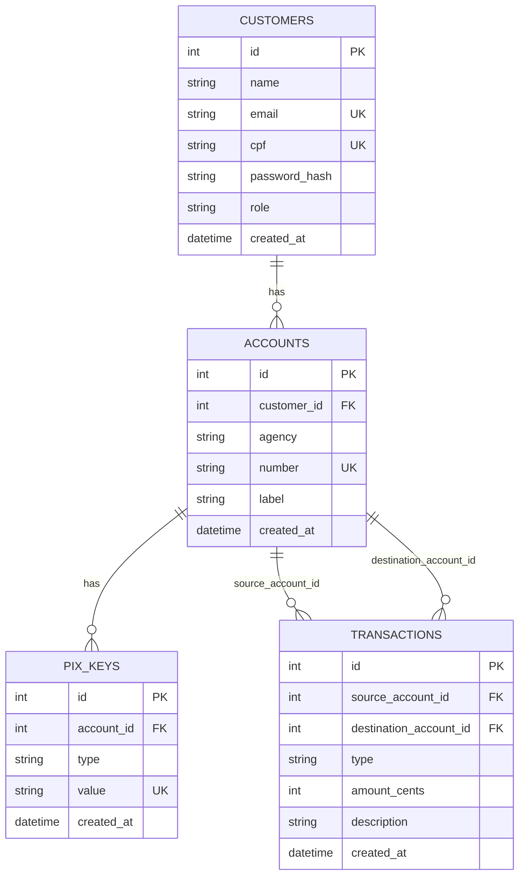

# 05 — Banco de Dados

## Visão geral

Banco **SQLite**, arquivo único `bank.db` na raiz do projeto (`app/infrastructure/config.py::DATABASE_PATH`).
Schema definido via SQLAlchemy 2.x (`Mapped`/`mapped_column`) em
`app/adapters/outbound/persistence/models.py` — 4 tabelas, sem nenhuma tabela auxiliar ou de
junção. As migrações versionadas vivem em `alembic/versions/`: `7af7709706ad_initial_schema.py`
(schema inicial) e `0f4be3daa031_remove_balance_cents_from_accounts.py` (remove a coluna de saldo
de `accounts` — ver seção "Saldo como projeção" abaixo).

## `customers`

| Coluna | Tipo | Constraints |
|---|---|---|
| `id` | `INTEGER` | PK, autoincrement |
| `name` | `TEXT` | `NOT NULL` |
| `email` | `TEXT` | `NOT NULL`, `UNIQUE` |
| `cpf` | `TEXT` | `NOT NULL`, `UNIQUE` |
| `password_hash` | `TEXT` | `NOT NULL` |
| `role` | `TEXT` | `NOT NULL`, default `'CUSTOMER'`, `CHECK(role IN ('ADMIN','CUSTOMER'))` |
| `created_at` | `DATETIME` | `NOT NULL`, default `now()` (UTC, gerado em Python por `_now()`) |

## `accounts`

| Coluna | Tipo | Constraints |
|---|---|---|
| `id` | `INTEGER` | PK, autoincrement |
| `customer_id` | `INTEGER` | `NOT NULL`, FK → `customers.id`, `ON DELETE RESTRICT`, indexado |
| `agency` | `TEXT` | `NOT NULL` |
| `number` | `TEXT` | `NOT NULL`, `UNIQUE` |
| `label` | `TEXT` | nullable |
| `created_at` | `DATETIME` | `NOT NULL`, default `now()` |

Não existe coluna de saldo. Ver "Saldo como projeção sobre `transactions`" abaixo.

## `pix_keys`

| Coluna | Tipo | Constraints |
|---|---|---|
| `id` | `INTEGER` | PK, autoincrement |
| `account_id` | `INTEGER` | `NOT NULL`, FK → `accounts.id`, `ON DELETE RESTRICT`, indexado |
| `type` | `TEXT` | `NOT NULL`, `CHECK(type IN ('CPF','EMAIL','PHONE','RANDOM'))` |
| `value` | `TEXT` | `NOT NULL`, `UNIQUE` |
| `created_at` | `DATETIME` | `NOT NULL`, default `now()` |

## `transactions`

| Coluna | Tipo | Constraints |
|---|---|---|
| `id` | `INTEGER` | PK, autoincrement |
| `source_account_id` | `INTEGER` | nullable, FK → `accounts.id`, `ON DELETE RESTRICT`, indexado |
| `destination_account_id` | `INTEGER` | nullable, FK → `accounts.id`, `ON DELETE RESTRICT`, indexado |
| `type` | `TEXT` | `NOT NULL`, `CHECK(type IN ('DEPOSIT','WITHDRAW','PIX_TRANSFER'))` |
| `amount_cents` | `INTEGER` | `NOT NULL`, `CHECK(amount_cents > 0)` |
| `description` | `TEXT` | nullable |
| `created_at` | `DATETIME` | `NOT NULL`, default `now()` |

Todas as `CheckConstraint` acima são declaradas diretamente em `models.py` (não são triggers
externos) e valem tanto para inserções feitas pela aplicação quanto para qualquer `INSERT`/`UPDATE`
manual no arquivo `bank.db`.

## Por que dinheiro é sempre `INTEGER` em centavos

`balance_cents` e `amount_cents` nunca são `REAL`/`float`. Representar dinheiro como ponto flutuante
introduz erros de arredondamento binário (`0.1 + 0.2 != 0.3` em IEEE 754) — inaceitável quando se
está somando e subtraindo saldo repetidamente. Usar inteiros em centavos (`1050` para R$ 10,50)
elimina essa classe inteira de bug sem precisar de um tipo `Decimal` ou de um `TypeDecorator`
customizado no SQLAlchemy — a soma e subtração de inteiros é sempre exata. A conversão para reais
formatados (`"R$ 10,50"`) acontece só no frontend, nunca no backend (ver `04-modelo-de-dominio.md` e
`08-frontend.md`).

## Saldo como projeção sobre `transactions`

`accounts` não tem coluna de saldo — `transactions` é a única fonte de verdade sobre movimentações
financeiras (event sourcing). O saldo de uma conta é sempre calculado somando os créditos
(linhas onde `destination_account_id` é a conta) e subtraindo os débitos (linhas onde
`source_account_id` é a conta):

```sql
SELECT
    COALESCE(SUM(CASE WHEN destination_account_id = :id THEN amount_cents END), 0)
  - COALESCE(SUM(CASE WHEN source_account_id      = :id THEN amount_cents END), 0)
FROM transactions;
```

Isso é feito em duas queries equivalentes em
`AccountRepositorySqlAlchemy._compute_balance()`, executadas toda vez que uma `Account` é lida
(`get_by_id`, `list`, `list_by_customer`). Depositar/sacar/transferir passa a ser só um `INSERT` em
`transactions` — nenhum `UPDATE` em `accounts` acontece nesses fluxos (ver `07-fluxos-principais.md`).
O trade-off consciente é ler mais (soma sobre todo o histórico da conta a cada leitura) para não
ter estado redundante nem risco de saldo e histórico divergirem — aceitável no volume de um projeto
acadêmico; em produção isso normalmente seria mitigado com uma projeção materializada/cache
recalculada a cada evento, o que este projeto não implementa.

## Por que `source_account_id`/`destination_account_id` são duas FKs opcionais na mesma tabela

Uma única tabela `transactions` com duas FKs nullable para `accounts.id` é a forma padrão de
modelar um "ledger" (livro-razão) simples sem precisar de tabelas separadas por tipo de movimentação
(o que exigiria `UNION` nas consultas de extrato). A regra de preenchimento depende do `type`:

| `type` | `source_account_id` | `destination_account_id` |
|---|---|---|
| `DEPOSIT` | `NULL` | conta creditada |
| `WITHDRAW` | conta debitada | `NULL` |
| `PIX_TRANSFER` | conta debitada | conta creditada (sempre diferente da origem) |

Essa invariante de forma **não** é implementada como `CHECK` composto no SQLite — um `CHECK`
combinando `type` com nulidade condicional de duas colunas ficaria pouco legível em SQL puro. Em vez
disso, é validada em Python antes de qualquer `INSERT`, por
`app/domain/transaction_rules.py::validate_transaction_shape()`, chamada explicitamente pelo Service
correspondente (`AccountService.deposit()`/`.withdraw()`, `PixTransferService.transfer()`) e coberta
por teste automatizado dedicado (`tests/unit/test_transaction_rules.py`, um caso por `type`).

`ON DELETE RESTRICT` nas FKs de `transactions` é uma **rede de segurança no banco**: na prática,
`AccountService.delete()` já impede a exclusão de uma conta que tenha qualquer transação associada
(ver `04-modelo-de-dominio.md`, regra "Exclusão bloqueada" de `Account`), então essa constraint nunca
deveria ser de fato acionada em uso normal — mas garante integridade referencial mesmo que uma
futura alteração no código esqueça essa checagem.

## Índices

- `UNIQUE(customers.email)`, `UNIQUE(customers.cpf)`
- `UNIQUE(accounts.number)`
- `UNIQUE(pix_keys.value)`
- `accounts.customer_id`, `pix_keys.account_id`, `transactions.source_account_id`,
  `transactions.destination_account_id` — todos indexados (`index=True` em `mapped_column`), usados
  nas consultas de listagem por dono (`list_by_customer`, `list_by_account`, `list_by_account` do
  extrato).

## Diagrama ER



## Regras de exclusão (resumo)

| Relação | Rede de segurança no banco | Onde é realmente bloqueado |
|---|---|---|
| `customers` → `accounts` | `RESTRICT` | `CustomerService.delete()`: `CustomerHasAccountsError` se `account_repo.list_by_customer(id)` não for vazio |
| `accounts` → `pix_keys` | `RESTRICT` | `AccountService.delete()`: `AccountHasDependenciesError` se `has_pix_keys(id)` |
| `accounts` → `transactions` | `RESTRICT` | `AccountService.delete()`: `AccountHasDependenciesError` se `has_transactions(id)` (saldo não-zero sempre implica transação existente) |
| `pix_keys` | sem dependentes | exclusão sempre permitida — `PixKeyService.delete()` não faz nenhuma checagem adicional |

Nenhuma exclusão em cascata (`ON DELETE CASCADE`) é usada em nenhuma FK — toda validação de
dependência acontece explicitamente na camada de Service, de forma visível no código, com a FK
`RESTRICT` apenas como reforço, nunca como a única linha de defesa.

## Conexão e sessão (SQLite específico)

`app/infrastructure/db.py` habilita `PRAGMA foreign_keys=ON` a cada nova conexão (SQLite, por
padrão, **não** aplica `FOREIGN KEY` a menos que essa pragma seja ligada explicitamente):

```python
@event.listens_for(engine, "connect")
def _enable_foreign_keys(dbapi_connection, connection_record) -> None:
    cursor = dbapi_connection.cursor()
    cursor.execute("PRAGMA foreign_keys=ON")
    cursor.close()
```

O `engine` é criado com `connect_args={"check_same_thread": False}` — necessário porque o SQLite,
por padrão, restringe uma conexão a uma única thread, e o `uvicorn` pode atender requisições em
threads diferentes de um mesmo worker. Isso não compromete a integridade dos dados: o SQLite garante
apenas um *writer* ativo por vez a nível de arquivo, o que é suficiente para o volume de um projeto
acadêmico — não é uma garantia de concorrência de nível produção, e o projeto não afirma que seja
(ver `10-decisoes-tecnicas.md`).
