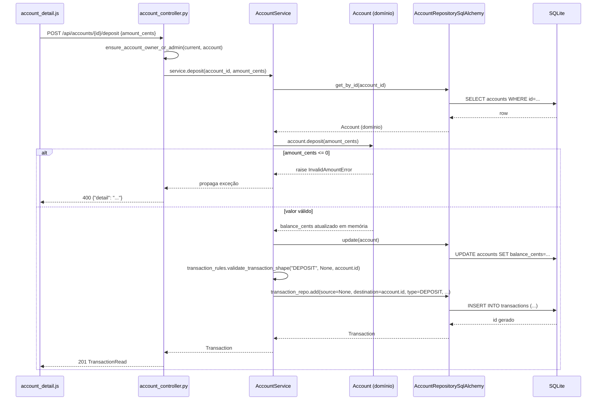
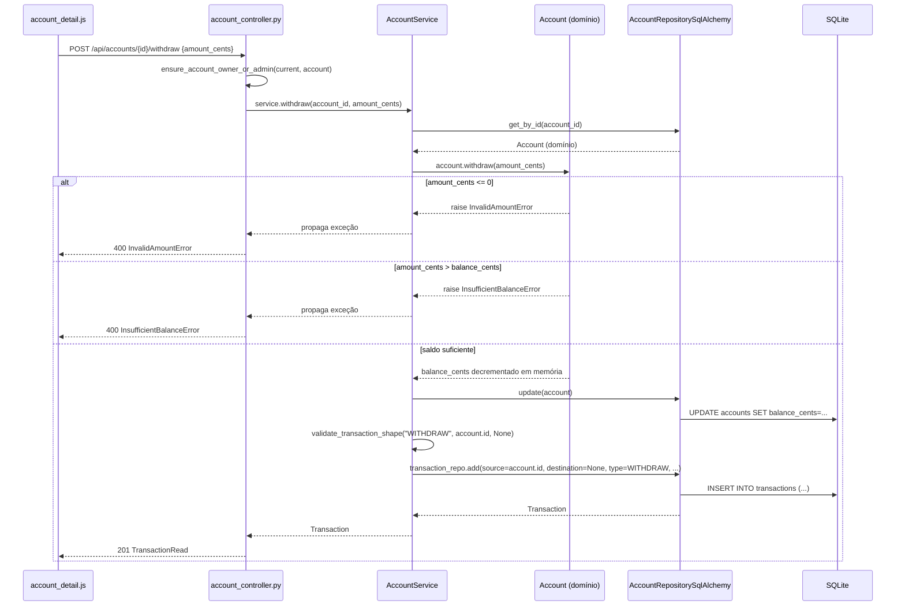
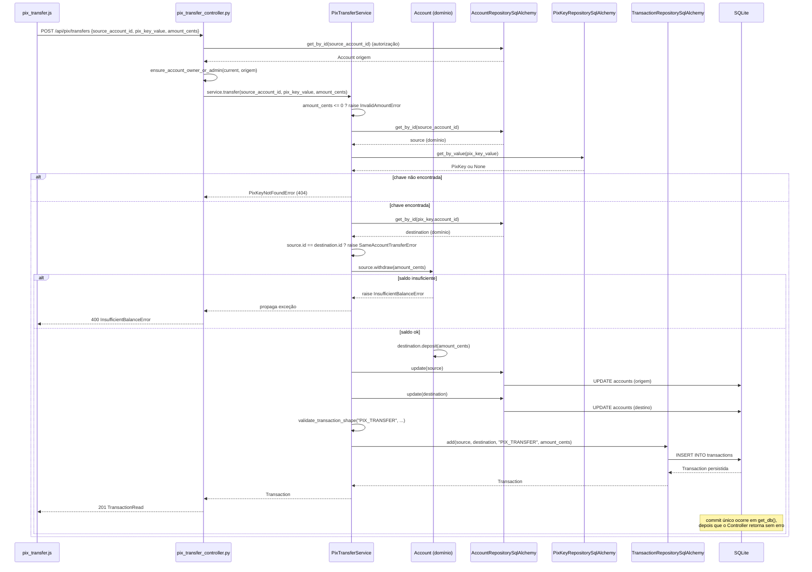

# 07 — Fluxos Principais

Este documento rastreia, com classes e arquivos reais, o caminho completo de cada caso de uso
principal:

```
Frontend → fetch() → Controller FastAPI → Service → Domínio → Repository Port → Repository Adapter → SQLAlchemy → SQLite → Response
```

## Create Customer

1. **Frontend:** `customers.js`, submit do `#customer-form` → `apiPost("/customers", {...})`.
2. **fetch():** `POST /api/customers`, corpo `{name, email, cpf, password, role}`.
3. **Controller:** `customer_controller.py::create_customer()` — checa `ensure_admin(current)`,
   chama `service.create(...)`.
4. **Service:** `CustomerService.create()` — valida CPF (`validators.is_valid_cpf`), checa email e
   CPF duplicados via `customer_repo.get_by_email`/`get_by_cpf`, gera `password_hash` com
   `password_hashing.hash_password()`.
5. **Domínio:** instancia `Customer(id=None, name=..., email=..., cpf=..., password_hash=...,
   role=...)` — dataclass pura, sem lógica adicional.
6. **Repository Port:** `CustomerRepository.add(customer)` (Protocol).
7. **Repository Adapter:** `CustomerRepositorySqlAlchemy.add()` — cria `CustomerModel`,
   `session.add()` + `session.flush()`.
8. **SQLAlchemy → SQLite:** `INSERT INTO customers (...)`, ainda dentro da transação aberta pela
   requisição.
9. **Response:** Controller converte para `CustomerRead.model_validate(customer)` → `201`.

## Create Account

1. **Frontend:** `accounts.js`, submit do `#account-form` → `apiPost("/accounts", {...})`.
2. **fetch():** `POST /api/accounts`, corpo `{customer_id, agency, number, label}`.
3. **Controller:** `account_controller.py::create_account()` — `ensure_admin(current)`, chama
   `service.create(...)`.
4. **Service:** `AccountService.create()` — verifica `customer_repo.get_by_id(customer_id)` (senão
   `CustomerNotFoundError`), verifica `account_repo.get_by_number(number)` (senão
   `DuplicateAccountNumberError`).
5. **Domínio:** `Account(id=None, customer_id=..., agency=..., number=..., label=...,
   balance_cents=0)`.
6. **Port → Adapter:** `AccountRepository.add()` → `AccountRepositorySqlAlchemy.add()`.
7. **SQLite:** `INSERT INTO accounts (...)`.
8. **Response:** `AccountRead.model_validate(account)` → `201`.

## Register Pix Key

1. **Frontend:** `account_detail.js`, submit do `#pix-key-form` → `apiPost("/pix-keys", {account_id,
   type, value})`.
2. **fetch():** `POST /api/pix-keys`.
3. **Controller:** `pix_key_controller.py::create_pix_key()` — primeiro
   `_ensure_owns_account(db, current, body.account_id)` (lê a conta direto do
   `AccountRepositorySqlAlchemy` para checar posse — ver nota em `03-arquitetura.md` sobre esse
   padrão), depois `service.create(account_id=..., key_type=body.type.value, value=body.value)`.
4. **Service:** `PixKeyService.create()` — confirma que a conta existe
   (`account_repo.get_by_id`), valida formato via `validators.is_valid_pix_key(key_type, value)`,
   confirma que `value` não está em uso (`pix_key_repo.get_by_value`).
5. **Domínio:** `PixKey(id=None, account_id=..., type=key_type, value=value)`.
6. **Port → Adapter:** `PixKeyRepository.add()` → `PixKeyRepositorySqlAlchemy.add()`.
7. **SQLite:** `INSERT INTO pix_keys (...)`.
8. **Response:** `PixKeyRead.model_validate(pix_key)` → `201`.

## Account Statement (extrato)

1. **Frontend:** `account_detail.js::loadStatement()` → `apiGet("/accounts/{id}/transactions")`.
2. **fetch():** `GET /api/accounts/{id}/transactions`.
3. **Controller:** `account_controller.py::get_account_statement()` — busca a conta
   (`service.get(account_id)`) só para checar posse (`ensure_account_owner_or_admin`), depois chama
   `service.get_statement(account_id)`.
4. **Service:** `AccountService.get_statement()` — reconfirma a existência da conta e delega ao
   Repository de `Transaction`. **Não existe uma classe `StatementService` separada** —
   diferentemente do que `docs/specs/06-architecture.md` lista na estrutura de diretórios, a lógica
   de extrato vive dentro de `AccountService`. O arquivo de teste
   `tests/service/test_statement_service.py` existe e é nomeado como se testasse um serviço
   dedicado, mas na prática exercita `AccountService`.
5. **Port → Adapter:** `TransactionRepository.list_by_account()` →
   `TransactionRepositorySqlAlchemy.list_by_account()` — `SELECT ... WHERE source_account_id = :id OR
   destination_account_id = :id ORDER BY created_at DESC`.
6. **Response:** lista de `TransactionRead`, mais recente primeiro. O frontend calcula a *direção*
   (entrada/saída) comparando `destination_account_id` com o id da conta atual — essa comparação
   não existe no backend, é puramente de apresentação (`account_detail.js::renderStatement()`).

## Deposit — passo a passo com diagrama de sequência



## Withdraw — passo a passo com diagrama de sequência



## Pix Transfer — o fluxo mais elaborado do sistema

`POST /api/pix/transfers` → `pix_transfer_controller.py::transfer()` → `PixTransferService.transfer()`.

Passo a passo, **na ordem real em que o código executa** (ver `pix_transfer_service.py`):

1. **Requisição entra** no Controller com `{source_account_id, pix_key_value, amount_cents}`.
2. **Controller busca a conta de origem primeiro, para autorização** —
   `AccountRepositorySqlAlchemy(db).get_by_id(body.source_account_id)`, direto no repositório (não
   via Service — ver nota em `03-arquitetura.md`). Se não existir, `404` imediato. Se existir,
   `ensure_account_owner_or_admin(current, source_account)` — só então o Service é chamado.
3. **Valor é validado primeiro, dentro do Service** — `if amount_cents <= 0: raise
   InvalidAmountError` é a **primeira** linha de `PixTransferService.transfer()`, antes de qualquer
   consulta ao banco.
4. **Conta de origem é localizada de novo, agora pelo Service** — `account_repo.get_by_id(source_account_id)`.
   Sim, a conta de origem é buscada duas vezes (uma pelo Controller para autorização, outra pelo
   Service para a operação) — consequência direta da concessão descrita em `03-arquitetura.md`.
5. **Chave Pix é resolvida** — `pix_key_repo.get_by_value(pix_key_value)`; se não existir,
   `PixKeyNotFoundError` (`404`).
6. **Conta de destino é localizada** — `account_repo.get_by_id(pix_key.account_id)`.
7. **Transferência para a própria conta é rejeitada** — `if source.id == destination.id: raise
   SameAccountTransferError` (`400`).
8. **Origem é debitada** — `source.withdraw(amount_cents)`, método de domínio de `Account`; é aqui
   que o saldo insuficiente é detectado (`InsufficientBalanceError`, `400`), **antes** de qualquer
   escrita no banco.
9. **Destino é creditado** — `destination.deposit(amount_cents)`, em memória.
10. **Ambas as contas são persistidas** — `account_repo.update(source)` e
    `account_repo.update(destination)`, cada uma com seu `UPDATE accounts SET balance_cents=...` via
    `session.flush()` (não `commit()` — ver `03-arquitetura.md`, seção "Atomicidade").
11. **Forma da transação é validada** —
    `transaction_rules.validate_transaction_shape("PIX_TRANSFER", source.id, destination.id)`.
12. **`Transaction` é persistida** — `transaction_repo.add(source_account_id=source.id,
    destination_account_id=destination.id, transaction_type="PIX_TRANSFER", amount_cents=...)`.
13. **Commit acontece uma única vez**, de volta em `get_db()`, depois que o Controller retorna
    normalmente — confirmando as duas atualizações de saldo **e** a nova `Transaction` juntas.
14. **Erro em qualquer ponto causa rollback implícito** — se qualquer exceção for levantada entre os
    passos 3 e 12 (saldo insuficiente, chave inexistente, erro inesperado ao persistir), a execução
    nunca alcança `session.commit()`; `get_db()` fecha a sessão sem confirmar, descartando tudo que
    foi feito com `flush()` até ali. Nenhuma conta fica com saldo debitado sem a `Transaction`
    correspondente.



## Nota sobre commit e rollback (mecanismo real)

Nenhum dos fluxos acima mostra um `session.commit()` explícito dentro do Service — e não deveria: o
commit acontece **uma única vez por requisição**, em `app/infrastructure/db.py::get_db()`, depois
que o Controller retorna sem exceção. Todos os métodos de escrita dos Repository Adapters usam
`session.flush()`, nunca `session.commit()`. Isso é o que garante atomicidade sem precisar de um
`with session.begin():` explícito dentro de cada Service — ver a explicação completa em
`03-arquitetura.md`, seção "Atomicidade: como funciona de fato", e o teste que comprova esse
comportamento, `tests/service/test_pix_transfer_service.py::test_transfer_atomicity_on_failure`.
